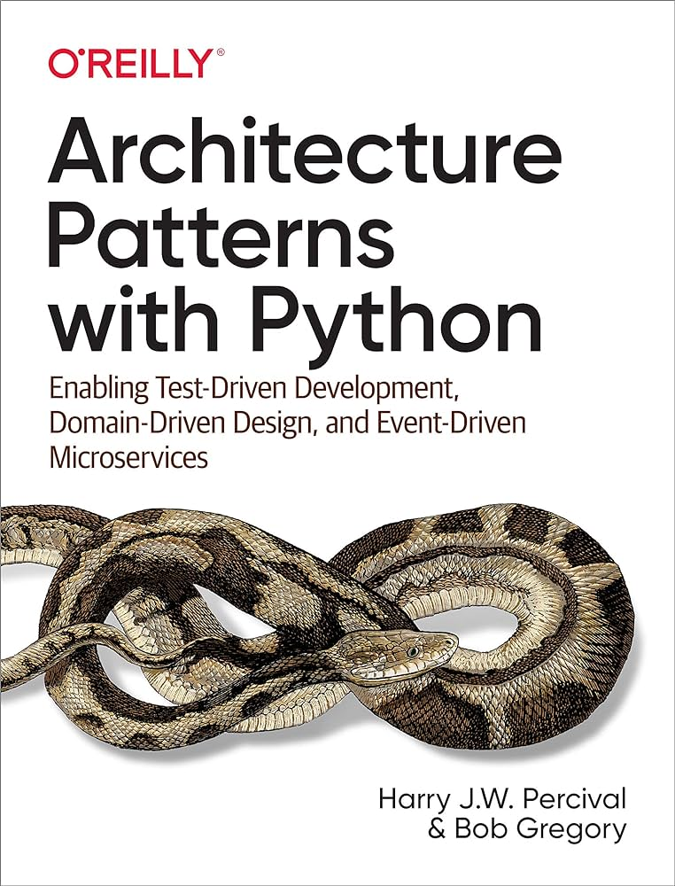

# Overview

Basic TypeScript implementation of different patterns from the Architecture Patterns with Python - Enabling Test-Driven Development, Domain-Driven Design, and Event-Driven Microservices book.

## What's in the repo

- [1-a-basicUsingKnex](./1-a-basicUsingKnex)
  - Implementation till the 6 chapter (inclusive)
  - Entities, Repositories, Unit of Work, Application Services (Use Cases), Unit Tests, Integration Tests, E2E tests
    - I've implemented entities in a way that they expose only read-only properties, so no one can change them directly (only via methods, which drive invariants)
- [1-b-basicUsingTypeOrm](./1-b-basicUsingTypeOrm)
  - Implementation till the 6 chapter (inclusive)
  - The same as in the previous, but using TypeORM instead of Knex plus more and improved tests (more unit tests, more integration tests, more E2E tests, and [Object Mothers](https://martinfowler.com/bliki/ObjectMother.html)), a better web-server abstraction, and Value Objects
  - I like this implementation more than the Knex one because TypeORM provides better data mapping
    - NOTE: **All the following implementations use TypeORM**
- [2-basicAggregates](./2-basicAggregates)
  - Implementation till the 7 chapter (inclusive)
  - The same as in the previous plus Aggregates, Optimistic Concurrency but without events / messages / commands
    - Optimistic Concurrency is implemented using the "REPEATABLE READ" transaction isolation level and the `version` column
- [3-aggregatesAndBasicDomainEvents](./3-aggregatesAndBasicDomainEvents)
  - Implementation till the 8 chapter (inclusive)
  - The same as in the previous plus a simple event bus
    - Aggregates expose internal domain events and they drive some side effects like sending emails
    - Events are used internally only
    - The core of the system is the same as in the previous implementations (it is NOT built around message processing yet)
  - Since more components are involved I've also added the Composition Root pattern to wire up the components and to be able to swap them with fake alternatives
- [4-eventDriven](./4-eventDriven)
  - ALMOST READY, BUT STILL IN PROGRESS
  - Implementation till the 12 chapter (inclusive)
  - The same as in the previous but the implementation is completely event-driven and follows CQRS
    - The core of the system is built around message processing
    - Application Services (Use Cases) are implemented as message handlers
    - Messages are split logically to Commands, external Commands, internal Events, external Events
    - External Events are emitted outside the system and external Commands are received from outside of the system (via Redis)
    - The system is split into a read model and a write model

Implementations 1, 2, 3, and 4 are completely independent from each other and ready to go. There is NO best implementation (aka a silver bullet) that always fits, but rather an implementation should be picked according to the current requirements and complexity. For simple CRUD applications, none of the above implementations are a good fit. Instead, you could use a framework per your taste, any ORM that you like, and even execute queries directly from controllers, this would be enough. If your application is more complex and you need to implement some business logic then one of the implementations above could be a good fit.

Each of the above implementations is split into:
- Controller -> Use Case (Application Service) -> Business logic orchestration -> Entities

But you don't have to make every request go through all the layers. Some simple requests can be handled directly in the controllers. Your application could be a mix of:
- Controller -> Use Case (Application Service) -> Business logic orchestration -> Entities
- Controller -> Queries to the DB / basic CRUD operations

A good example is in the 4th implementation. This is not surprising, because this implementation follows CQRS, so read requests are handled directly in the controllers (e.g. [./4-eventDriven/entrypoints/webServer/controllers/GetOrderAllocationsController.ts](./4-eventDriven/entrypoints/webServer/controllers/GetOrderAllocationsController.ts)). 

## How to start locally

- Install Bun https://bun.sh
- Open an implementation folder (e.g. `cd 3-aggregatesAndBasicDomainEvents`)
- Run `bun install`
- Run `docker run --name postgres -e POSTGRES_PASSWORD=postgres -p 5432:5432 -d postgres` (it will create a docker container with a Postgres database)
  - WARNING: Connection parameters to the database are hardcoded in the code, they're always user: `postgres`, password: `postgres`, host: `localhost`, port: `5432`, database: `postgres`
  - The database schema is different from implementation to implementation, so if you want to switch between implementations you need to drop the database and create it again (simply remove the container and create it again)
- To start the event-driven implementations you also need to start a Redis container `docker run --name redis -p 6379:6379 -d redis`
  - WARNING: Connection parameters to the event bus are hardcoded in the code, they're always host: `127.0.0.1` port: `6`, database: `postgres`
- Run tests
  - `npm run test`
  - `npm run test:infra`
  - `npm run test:e2e`
- Start the server `npm run start:ts`
  - Access endpoints via `http://localhost:3000/<route>`
- Refer to the `route.ts` file of the current implementation to find all routes (e.g. [./3-aggregatesAndBasicDomainEvents/entrypoints/webServer/routes.ts](./3-aggregatesAndBasicDomainEvents/entrypoints/webServer/routes.ts))
- Refer to the `eventsMapping.ts` file of the current implementation to find all events (internal and external) (e.g. [./4-eventDriven/entrypoints/eventBus/eventsMapping.ts](./4-eventDriven/entrypoints/eventBus/eventsMapping.ts))

## TODO

- [ ] More tests in the 4th implementation
- [ ] Final review and refinement
